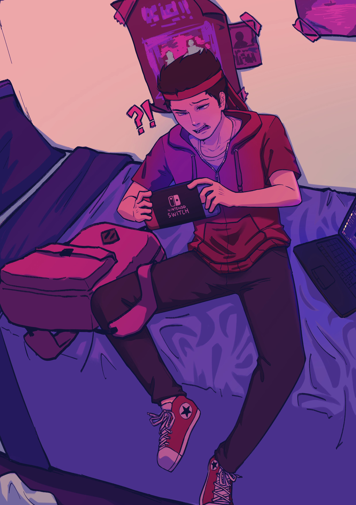

---
authors:
  - tomas
categories:
  - Tech
tags:
  - app
  - dev
date:
  created: 2026-03-16
  updated: 2026-03-16
draft: false
comments: true
---

# BeABetterFriend.app

it's finally here! [Be A Better Friend the App](https://beabetterfriend.app).

<!-- more -->

Completed & available for both iOS & Android, free and private.

Thought i'd share a little bit of why & how it was made.

## The Why

The main problem arose from not having all my friend's information in one neat place and how I forget my friend's birthday all the damn time.

LIKE LOOK AT THIS, SHE MADE ME THIS FOR MY BIRTHDAY and what did I get her?

Nothing. I forgot 💀

<!-- Yeah I wasn't joking in the [confession](https://linkedin link) -->

So originally I started using an Obsidian Template (Which didn't work anymore since I moved to VS Codium) and plain old `.md` files. It worked but it was stuck to my pc, it didn't have the portability. It also depends on me checking my notes, I thought why couldn't it just have been automatic, I get a notification when my friend's birthday is near?

So I came up with an idea for an app, mind you I have never developed an app.

My only experience with coding is JavaScript & Python, with some knowledge of Lua, GodotScript & C. I soon found out about Capacitor from Ionic which allows me to use my own framework (none, in my case) and creates a web/app for both android, ios and web.

## The How

So yeah the tech stack is:

- HTML
- CSS
- JS
- Capacitor
- SQLite3

Yup all plain, no frameworks or anything fancy.
Should have definitely used one...

If I made the app in one day, sure but oh boy maintaining pure JS is really something.

### The Logo

As I was making the app, I got the name Better Friend. Kinda on point but after searching and seeing no apps with that name and some domains free'd up for it, I thought why not?

As for the logo I always had an idea of what I wanted it to be, like a clover, or a group of friend's hugging. And purple, I don't really know how to explain it but the logo and color, I was already dead set on what I wanted. Purple felt like a really neutral color and new, didn't want to step on other apps toes (youtube red, amazon prime blue, etc)

I got my mom to work off some very isometrical doodles I made and she made the end result. It was perfect, 4 hearts with the space touching removed. And then it kind of stuck. Purple, 4 and the clover. I really like it.

<?xml version="1.0" encoding="UTF-8" standalone="no"?>
<!DOCTYPE svg PUBLIC "-//W3C//DTD SVG 1.1//EN" "http://www.w3.org/Graphics/SVG/1.1/DTD/svg11.dtd">
<svg width="100%" height="100%" viewBox="0 0 2700 2700" version="1.1" xmlns="http://www.w3.org/2000/svg" xmlns:xlink="http://www.w3.org/1999/xlink" xml:space="preserve" xmlns:serif="http://www.serif.com/" style="fill-rule:evenodd;clip-rule:evenodd;stroke-linejoin:round;stroke-miterlimit:2;">
    <path d="M817.508,1888.88C626.348,1966.38 446.602,1951.74 350.116,1844.97C238.302,1721.23 238.302,1473.75 461.93,1350.02C238.302,1226.28 238.302,978.803 350.116,855.064C446.602,748.284 626.349,733.647 817.509,811.151C829.821,841.518 844.457,872.173 861.419,902.828C948.018,1070.51 1170.67,1238.2 1356.25,1350.01C1170.67,1461.83 948.018,1629.51 861.419,1797.2C844.457,1827.86 829.82,1858.51 817.508,1888.88ZM817.509,811.151C740.007,619.991 754.644,440.244 861.419,343.757C985.158,231.943 1232.63,231.943 1356.37,455.571C1480.11,231.943 1727.58,231.943 1851.32,343.757C1958.1,440.244 1972.74,619.991 1895.24,811.152C1864.87,823.464 1834.21,838.101 1803.56,855.064C1635.87,941.663 1468.19,1164.31 1356.37,1349.9C1244.56,1164.31 1076.87,941.663 909.187,855.064C878.532,838.101 847.876,823.463 817.509,811.151ZM1895.24,1888.88C1882.92,1858.51 1868.29,1827.86 1851.32,1797.2C1764.72,1629.51 1542.07,1461.83 1356.49,1350.01C1542.07,1238.2 1764.72,1070.51 1851.32,902.828C1868.29,872.174 1882.92,841.519 1895.24,811.152C2086.4,733.647 2266.14,748.284 2362.63,855.064C2474.44,978.803 2474.44,1226.28 2250.82,1350.02C2474.44,1473.75 2474.44,1721.23 2362.63,1844.97C2266.14,1951.74 2086.4,1966.38 1895.24,1888.88ZM817.508,1888.88C847.876,1876.57 878.532,1861.93 909.187,1844.97C1076.87,1758.37 1244.56,1535.72 1356.37,1350.13C1468.19,1535.72 1635.87,1758.37 1803.56,1844.97C1834.21,1861.93 1864.87,1876.57 1895.24,1888.88C1972.74,2080.04 1958.1,2259.78 1851.32,2356.27C1727.58,2468.09 1480.11,2468.09 1356.37,2244.46C1232.63,2468.09 985.158,2468.09 861.419,2356.27C754.644,2259.78 740.007,2080.04 817.508,1888.88ZM1356.37,1349.9C1356.39,1349.92 1356.4,1349.95 1356.42,1349.97C1356.4,1349.96 1356.39,1349.95 1356.37,1349.94C1356.36,1349.95 1356.35,1349.96 1356.33,1349.97C1356.35,1349.94 1356.36,1349.92 1356.37,1349.9ZM1356.33,1349.97C1356.32,1349.98 1356.31,1350 1356.3,1350.02C1356.31,1350.03 1356.32,1350.05 1356.33,1350.06C1356.3,1350.04 1356.28,1350.03 1356.25,1350.01C1356.28,1350 1356.31,1349.98 1356.33,1349.97ZM1356.33,1350.06C1356.34,1350.07 1356.36,1350.08 1356.37,1350.09C1356.39,1350.08 1356.4,1350.07 1356.42,1350.06C1356.4,1350.08 1356.39,1350.11 1356.37,1350.13C1356.36,1350.11 1356.34,1350.08 1356.33,1350.06ZM1356.49,1350.01C1356.47,1350.03 1356.44,1350.04 1356.42,1350.06C1356.43,1350.04 1356.44,1350.03 1356.44,1350.02C1356.43,1350 1356.43,1349.99 1356.42,1349.97C1356.44,1349.99 1356.46,1350 1356.49,1350.01Z" style="fill:rgb(153,51,204);"/>
</svg>

## Developing

As for developing it was long process, mainly because

### Getting a Mac

So after reaching a point, I realized I needed a macOS device that runs the latest version, so I can test and publish the app.
The problem is the oldest mac we had was 2012, which was several versions behind. After researching and going around used selling groups, the best thing I found was a 2013 MacBook which again couldn't even run the latest version. Time was running out, I had a couple of colleagues I could borrow their Mac but none of them are programmers so I'd have to download XCode, Node, etc and probably would have to use it multiple times, which could be inconvenient since they all use it for work.

I even considered telling my friend from over sees to bring me one, the problem is it would be way out of budget.
So I was even considering giving up, swapping to MacInCloud or something similar. Then it happened, my Dad searched on Magalu and out of nowhere, there was an officially sold by Magalu, brand new and not sold by a stranger, for 2500 reais (Literally the price of some used 2012 Macs people were selling). It was the perfect version to, a 2018 Mac, i3 with 8GB (Upgradable), anyways we bought it asap. Two days later it showed up, and after updating it it ran the version Sequoia, it worked.
Then for curiosity I checked the Magalu store again, to see if it was still in stock. And it was, but the price went back up to almost 7k reais.

It really was a miracle.

Then I became a shill for mac and sold my gaming laptop for a M2 on black friday.

macOS is genuinely really good, it just works and required so much less debloating to make windows actually usable. Another blog idea, my favorite macOS extensions, just gotta write it. 😩

### Procrastination

Then I procrastinated for almost a year.

Mainly had a lot going on my life, specially with work. Didn't wanna code after spending the day coding hahaha.

And I don't know but I lost motivation, mostly felt kinda dumb for making it? I don't know how to explain it, like it was gonna flop. Even I stopped using my OWN app, how crazy is that?

The project got in a weird state where I didn't really update it. It had a lot of really horrible bugs that I couldn't find out how to fix, but in retrospect I hadn't really given it my all to fix it.

What got me out of that trance was working on the site and consistency.

And I also realized it would be so much worse if I got so close and didn't release than release later than never or someone else did my idea.

### Site

Instead of working on the app, I procrastinated on the site which has a much nicer tech stack, NextJS, TailWind CSS & [React Bits](https://reactbits.dev), and it was awesome.

I really didn't get the whole hype but wow it's so much easier to edit in the long term, like just swap the pre made blocks or tweak a bit of the code. Especially the swap from the site **not live** to being **live**, was so great. Just swapped a couple of componentes, bada bing bada boom.

BUT THERE WAS A PROBLEM.

HOW ON EARTH DO YOU SELF HOST REACT WITHOUT PORT FORWARDING?

HTML/JS is just a file so it's much easier, my NextJS I made it so it's a server. What I did instead of paying a measly 10 dollars a month was, I self hosted Coolify + Cloudflare on my old gaming laptop. I love this little set up so much (Still need to fix my current fix of redirecting, the url is new.beabetterfriend.app and not beabetterfriend.app)

Take that tech overlords, i'll publish a guide on how to do that eventually. It's a great experience and honestly can't wait to use it for more projects. It was a small pain to set up but man i've been testing and playing around with it, so awesome.

### Testing

Gotta say huge shoutout to all my friends who helped test the app and downloaded it, just the fact someone sent me a message asking hey tom, where's my app? or dude that's such a good idea.

it really made my day in such an unimaginable way, it really felt like what I was doing had impact. I think like 4 of them know I have a blog hahaha, thanks guys!

## Challenges

### Translations

I want the app to be for everyone, that's why having support for multiple languages is such a fundamental feature.

The problem is I only know 3, what about the rest? I could get friends to help me out but the way I currently have it implemented needs to be improved. So I create a repo inside a repo, that way the repo inside is public so it's super easy for anyone to add languages (super easy if you know github. May make a nice front end for this soon).

Check it out [here](https://github.com/Shadow1363/betterfriend-translations) and would love it if you could contribute!

### File loading

So for some reason the way files are loaded is pretty weird in Capacitor, not sure if it's just for it or all apps. But basically the issue is that trying to load a file after the app is running, a `.json` or `.svg`. The path would be wrong so what was the solution? Just make all the files `.js` and preload them.

Yeah I don't know if it's "optimal" but hey it works, really simple solution.

### The other stuff

Making an App is half the battle, what about the designs, marketing and videos? I could make a ok video but nothing too crazy, luckily one of my friends was down to help me in video editing. It was a little rough the first time, but learning from it and experiences from my work, I think the next few videos will come out better.

As for graphics, it was my Mom again that helped me & Mockuuups Studio, I gave her a few examples of what I had and she made some great work. I really like how the last image of the app on the stores, it's just people because that's what the app is, it's a helper not a replacement. The gradient was a nice touch too.

## Retrospective

Definitely embarrassed with how long it took me to get this out, almost a full year for a simple offline app (ffs) but i'm still quite happy for the journey, all the ups and downs. How much I grew coding wise, Glad I managed to release the app before apple charged me another year too, yikes I get it why every extension is paid now on macOS.

Overall a lot of money was spent, I rather not think about it 😭 but hey at least I can brag i'm an app developer.

## The Future

I do want to keep updating the app, already got some bugs that need ironing out & features to add.

Oh yeah and WIDGETS! LIKE HOW DID I NOT THINK ABOUT THIS EARLIER FUC-
