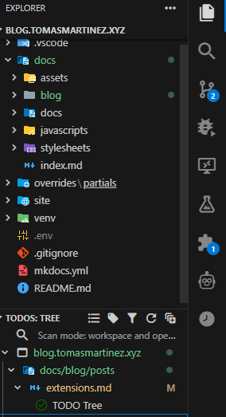

---
authors:
  - tomas
categories:
  - Tech
tags:
  - extensions
  - vscode
  - vscodium
date:
  created: 2025-03-10
  updated: 2025-03-10
draft: true
comments: true
---

# Best VSCode Extensions

My personal favorite VSCode extensions

<!-- more -->

Okay I kinda lied, I actually use VSCodium, the no-microsoft-version of VSCode, but all of these still apply! I organized them into various categories.

One other thing to note is I use VSCodium like a all in one tool, so some aren't necessarily code focused. I use my VSCodium also as an Obsidian clone and also as my Java workspace. I prefer it as it allows me to easily access everything.

## Code

### General

#### Prettier

All in one code formatter, helps me stay organized

#### Error Lens

#### Code Runner

All in one code runner

#### Font Preview

Extension that allows you to open .tff files and see how they look

#### TODO Tree

A simple tool that allows you to leave `TODO:` and it will show all instances of it, I like it because of its versatility, works with any file and allows me to have all my pending work in my work space at a quick glance. To learn about the theme go [here](#theme)!



### Open in Browser

Opens a new tab with your localhost environment, similar to Trae.
Made by yours truly. 

#### Better comments

Allows changing the color of certain comments, this tool pairs up really nicely with Todo tree and makes all my todo's be orange, so I immediately know what is pending.

### C

#### ClangD

#### CMAKe

### Java

#### Extension Pack for Java

Basically a must have for coding Java in VSCode.

github.com/Microsoft/vscode-java-pack.git

### Python

#### Ruff

It's a fast and clean linter.

### JS/TS

#### Prettier TypeScript Errors

#### BiomeJS

A smarter/more powerful formatter for JS/TS, for some reason though after a new update mine kind of broke, so I downgraded version. Aside from that, it's great.

## Linters

## Theme

First we want VSCode to look nice, personally i'm a big fan of these two extensions they change how files and the icons look.

[Material Icon theme](#material-icon-theme) also has support for creating custom folders, here's a snippet of one I did for my university.

```json title="settings.json"
  "material-icon-theme.folders.customClones": [
    {
      "name": "anhanguera-folder",
      "color": "#ff4e18",
      "base": "folder",
      "folderNames": ["Anhanguera"]
    }
  ]
```

### JetBrains Mono

Huge fan of this font, it has l

### Material Icon Theme

<a href="https://github.com/material-extensions/vscode-material-icon-theme">
    
</a>

### Material Product Icons

<a href="https://github.com/material-extensions/vscode-material-product-icons">
    
</a>

## Miscellaneous

## Markdown

### Markdown All in One

https://github.com/yzhang-gh/vscode-markdown

### Marky Markdown

A collection of 4 QOL improvements to using VSCodium to write.

<a href="https://github.com/robole/vscode-marky-markdown">
    
</a>

### Emoji Sense

Adds easy emoji support 😄 `:smile:`

https://github.com/mattbierner/vscode-emojisense

### Foam

Best extension I found to get all Obsidian features into VSCode


# Wrapping up
Hey thanks for checking it out, if there's any extension I missed or one you made, leave a comment below! I'd love to check it out.

