---
authors:
  - tomas
categories:
  - Tech
tags:
  - guide
  - minecraft
date:
  created: 2025-04-13
  updated: 2025-04-13
draft: true
comments: true
---

# Old Laptop to cross-platform Minecraft Server

Turning broken laptop into a Java/Bedrock Minecraft using Proxmox, PaperMC & Geyser

<!-- more -->

My goal with this guide is to be as simple to follow so everyone can reduce their tech waste and get a neat little minecraft server to go with it.
If you get stuck or need help, do leave a comment below using Github!

Here's the laptop, my good friend Bumblebee, he was a used laptop I picked up around ~2020 in Singapore. Top of the line laptop, well at least for 2014 standards, he's already more than 10 years olds.

- RTX 860M
- 32 GB of Memory
- i7 7th Gen

As the years dragged on so did Bumblebee, camera stop working, disk stop working (not like I used it), and finally the hinge broke off and he was out for the count. BUT today i'm going to give him one last job, until he finally blows up.

## What we will be doing

1. Proxmox (VM Panel)
2. PaperMC & Geyser (Minecraft Java/Bedrock Crossplay)
3. Configuring (Allow external connections, port forwarding, etc)

## Installing Proxmox

So first thing first is install Proxmox which is basically a server management/panel. We will be using it because it allows us to create VM's, CT's and run anything else we want inside of it. Such as [Pterodactyl](https://pterodactyl.com), but that will be for another tutorial, it's better to understand how it's done underneath before we move on to installing pterodactyl in case something does go wrong, we already know the inner workings.

### ISO

Before we start creating our Proxmox, we need to give it a .ISO file. In short an .ISO file is the operating system, like how your phone runs Android or IOS. If were to create it we would have absolutely nothing running on it.

First we need a thumb drive, to flash the ISO on.
heading to and other pc

### Creating panel

And boom!
Now we head over to the created panel:
https://192.168.1.113:8006/
(Your resulting IP may be different!)

To login we use our password we set up and use the username root.

#### Setting ISO

We won't run Windows for multiple reasons, mainly being performance and bloat. Instead we will run Ubuntu Linux. Imagine Windows being Water, there's only one Windows 11.
Linux, on the other hand being an ice cream. Where you can have millions of different flavours to accomplish a different goal. Ubuntu is vanilla flavour ice cream, it will get our job done.

Hope that made sense.
So to run our operating system we need to go to storage and install it on local, we don't have to install it on our SSD/HDD, unnecessary use of space. Then we click on ISO Images. (Ignore 111 and 115, those are other things I have set up and won't be part of the tutorial)

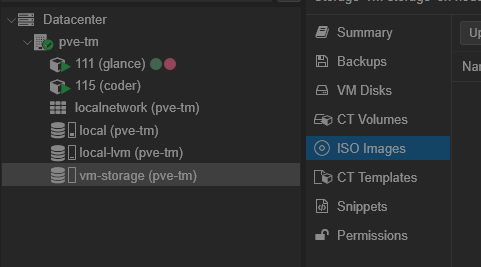

Then we are going to do through download from URL.

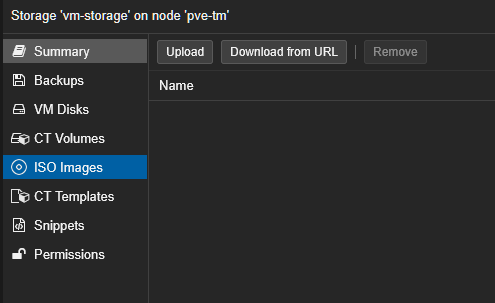

Depending on when you read this tutorial there may be a newer version,

```
https://releases.ubuntu.com/24.04.2/ubuntu-24.04.2-live-server-amd64.iso
```

We paste and query and we should get something like this.
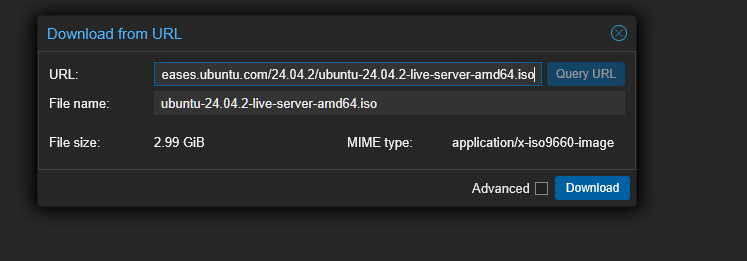

Now we download and wait!

#### Creating VM

Now for the fun stuff, here we can create a VM or use [Proxmox Scripts](https://community-scripts.github.io/ProxmoxVE/), to automate this process but I think it's good to have base of knowing how it works underneath before we try and take the lazier route.

So what even is a Virtual Machine?
If you've seen the movie the Matrix, Neo is living inside a digital world. That's basically what we are going to do.
We are going to make our computer running a mini computer inside of it that things its a real computer.

On the top right hand side, we have create VM. Let's click that!
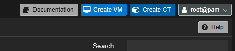

And now we are off, here we just need to focus on: `node`, `VM ID` & `name`,
node should be auto configured but basically it's saying what node we are running. Proxmox let's us have multiple nodes, as in multiple laptops running and controlled via Proxmox. Id should be something unique, so i'm going with 112, since I already have 111 taken. And name let's just go with minecraft, easy to remember.
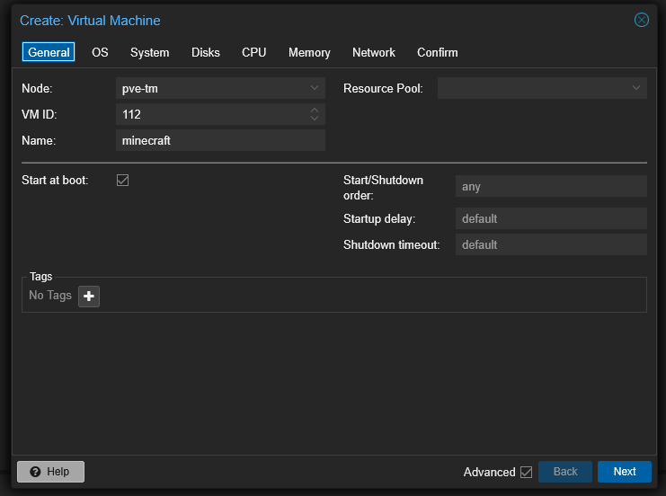

For OS, here we will use the local storage and import the .iso we downloaded. Everything else doesn't need to be configured.
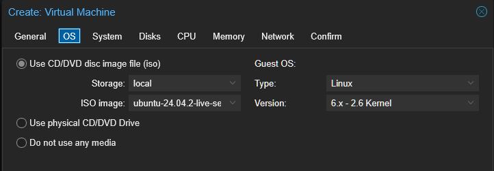

For System, we can leave everything as default EXCEPT for `Machine` & `Qemu Agent`.
For me default is `i440fx`, which is legacy. Granted if you have a really old PC it could be worth sticking with default. But in my tests `q35` gave me unnoticeable to better performance and being more modern. Qemu Agent basically makes Proxmox talk to the VM better. Makes our life easier.
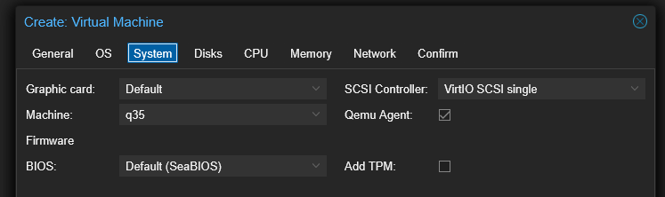

For Disks, I set `storage` to be my 512GB SSD and set `format` to raw. Since it's a minecraft server and I don't plan on increasing size, raw works fine.
`cache` I set to be Write Back, since this is a laptop, it actually has the benefit of keeping the power in case of an outage. Granted like about an hour due to the battery condition but it works.

Then I also set `SSD emulation`, `Discard` & `IO Thread` & `Backup` to _true_. Make sure to set Advanced to true to see all the options, this is one of the few times it's used.

you may also have noticed there a sub tab of Bandwidth, this is more if we want to limit the connection. so if that's your case go ahead and take a look.

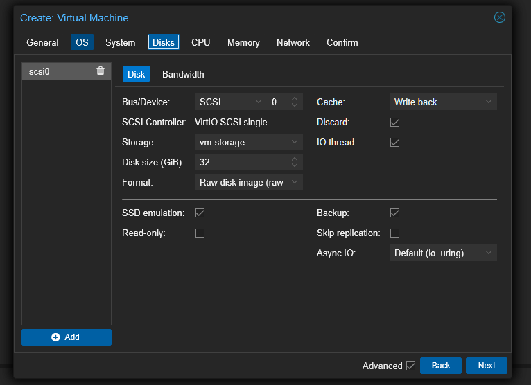

For CPU, we basically need to set `cores` to 2, we can always configure later and set `type` to host. Basically type tries to use a standard, but since I plan only on running this on the yellow pc, for best compatibility with our device we use `host`.
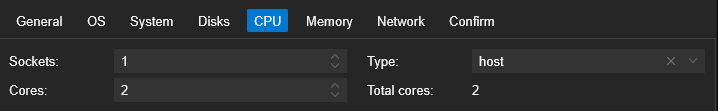

For Memory, we set `memory` to 8gb (8192MiB). since we plan on running modded minecraft, we should aim for 6-8GB. Vanilla with optimizations you could get it as low as 2GB but this also depends on a lot of other variables, player count, types of mods, how big the world is, etc. And we set the `Minimum memory` to 2GB (2048MiB), that way it auto adjusts on players, no need to use 8GB when everyone's asleep.
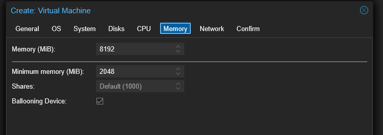

For Network, we can just skip. It's already configured to use the same wifi so no problem there.

And we are finished, now we can hit finish and start after created! This may take a while, so sit tight.
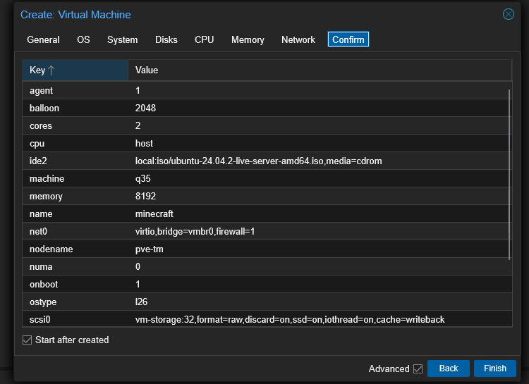

### Connecting through SSH

It's installed, lets follow along the configure steps for our Ubuntu operating system. We select our language and go with default for everything else.
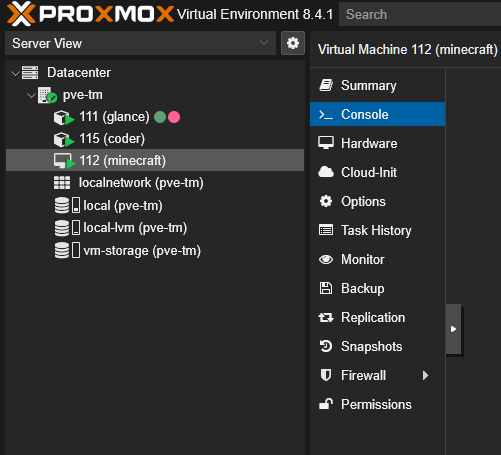

here's where it gets interesting, we have to configure a user just like windows. Remember what you wrote down as this will be helpful later.
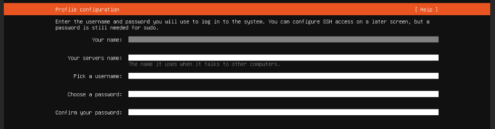

Skip ubuntu pro.

Allow password authentication and install OpenSSH!
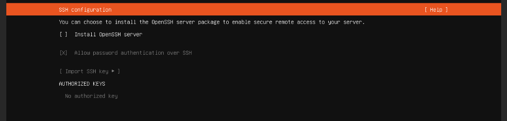

Skip the snaps, it's other cool software we can use. But not for this.

Now when it finishes installing we can now reboot.

So it worked BUT the console doesn't support copy paste, womp womp.
So good ol [Putty](https://www.chiark.greenend.org.uk/~sgtatham/putty/latest.html) to the rescue

In the Proxmox console we can run this to get the IP

```bash
hostname -I
```

now it will return the ip so we head over to putty and run:
`@user/@ip 22`

Then login with the password we made on configuring the Linux install.

Now we have to run the commands it provides.

#### commands

here are some useful commands to know:
`ls` list directory
`cd` is to go inside a folder.
`cd ..` is to go back one step
`wget <link>` installs whatever the link is
`mkdir <folder>` creates a folder

so if we want to install a link inside a new folder here's how we'd do it:

```bash
mkdir folder
cd folder
wget link
ls # Guarantee installed is there
cd .. # Exit Folder
```

## Minecraft

### Install Java

We will be following PaperMC's guide to install Java 21.
https://docs.papermc.io/misc/java-install/
Basically run the commands and type `Y` when prompted

### PaperMC

PaperMC is simple and already pre configured.
While I do prefer Fabric (more mods), it's a lot more effort to set up, with PaperMC we get out of the box optimizations.
To install we go to the downloads and run wget with the download link.
https://papermc.io/downloads/paper
Now that's installed we have to use nano to edit the EULA (Terms of Use) for Minecraft.
If you want you can already test it out on

### GeyserMC (SFTP)

https://geysermc.org/wiki/geyser/setup/?host=self
In my case I had to use Secure File Transfer Protocol (SFTP), to get the file on the server.
Running wget or curl, didn't work.

So I installed WinSCP and just like putty connect to it.

### Floodgate

Floodgate is an authentication that will allow us to authenticate Java.
So same process, install .jar and throw it into the plugins folder, run server again making sure it finds it.
Then we use `nano server.properties` & set `enforce-secure-profile: false` in server.properties.

## Configuring

Great we can join from localhost but no one from outside our network could join.
So we have to configure that:
First activate the firewall with:

```bash
sudo ufw enable
```

Then we enable

```bash
sudo ufw allow 25565/tcp # Java Port
sudo ufw allow 19132/udp # Bedrock Port
```

Reload just to confirm:

```bash
sudo ufw reload
```

And run this to check

```bash
sudo ufw status
```

It should return something like this:

```
Status: active

To                         Action      From
--                         ------      ----
25565/tcp                  ALLOW       Anywhere
19132/udp                  ALLOW       Anywhere
25565/tcp (v6)             ALLOW       Anywhere (v6)
19132/udp (v6)             ALLOW       Anywhere (v6)

```

So far it's still not available to anyone since all traffic passes through our router, so we need to port forward.
Basically take our routers ip, which is publicly accesible, give it a port. So let's say
TomasIP:12345
and tell it that it corresponds to our machine on the local network of port 25565 and 19132.
